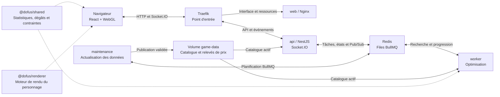

# Dofus Stuffer

Application web pour préparer et rechercher des stuffs Dofus PC, avec priorité au PvM. Le navigateur affiche les caractéristiques et dégâts ; les recherches longues tournent dans un processus séparé et transmettent leur progression en temps réel.

## Le projet en un coup d'œil

| Fonction | Ce que l'application permet |
|---|---|
| Personnage | Choisir parmi 19 classes, régler niveau et parchotage, optimiser automatiquement les points de base |
| Atelier de recherche | Combiner statistiques, dégâts de sorts ou d'arme, chance de critique et budget ; ordonner les priorités et imposer des seuils obligatoires |
| Équipements | Construire un stuff, verrouiller sa base, exclure des objets et rechercher avec 0, 1 ou 2 exos PA/PM maximum |
| Simulateur | Comparer dégâts normaux et critiques, résistances, états et effets liés dans une situation choisie |
| Apparence | Voir le personnage équipé et orientable, rendu en WebGL dans le navigateur avec les ressources du jeu |
| Prix | Saisir ou importer un carnet par serveur, estimer le coût complet du stuff et les suppléments des exos |
| Recherche asynchrone | Suivre progression et propositions en direct, arrêter une recherche et retrouver son état après reconnexion |
| Données | Utiliser un catalogue livré avec le projet et vérifier automatiquement ses mises à jour chaque semaine |

Le projet est un **monorepo TypeScript avec npm workspaces** : React 19 et Vite pour l'interface, NestJS 11 pour l'API, BullMQ et Redis pour les recherches, Socket.IO pour le suivi en direct. Les calculs sont partagés entre le navigateur et le worker. Le déploiement principal utilise Docker Compose sur Linux.

**Repères :** [lancement Linux](#lancer-sur-linux) · [utilisation](#utilisation) · [périmètre et limites](#périmètre-et-limites) · [architecture et Graphify](#architecture-et-graphify) · [développement](#développement-et-vérifications) · [organisation](#organisation) · [documentation](#documentation) · [lanceur Windows](#option-windows-pour-le-développement-local).

## Lancer sur Linux

**Linux est la cible principale de déploiement.** Installer Docker Engine et le plugin Docker Compose, puis copier ou cloner le projet sur le serveur. Docker Desktop, Windows, .NET, Node.js et Python ne sont pas nécessaires sur cet hôte.

Depuis le dossier du projet :

```sh
sh scripts/start.sh
```

Le script crée `.env` à partir de `.env.example` s'il est absent, construit les images, démarre les six services et attend Redis ainsi qu'un worker disponible. Il conserve une configuration `.env` existante et affiche l'adresse à ouvrir. Le premier lancement télécharge les images et dépendances ; le catalogue et les icônes du jeu sont fournis dans le projet.

Par défaut, l'application répond sur **http://localhost:8080** depuis le serveur. Le poste de développement actuel utilise le port 8180 dans son `.env` local ; ce fichier n'est pas versionné.

### Accès depuis un autre ordinateur

Pour servir l'application sur l'IP du serveur Linux, créer `.env` depuis `.env.example`, puis y définir :

```dotenv
APP_PORT=8080
APP_BIND_ADDRESS=0.0.0.0
```

Relancer `sh scripts/start.sh`, puis ouvrir `http://IP_DU_SERVEUR:8080`. Le port choisi doit être autorisé par le pare-feu du serveur. Seul Traefik est publié ; l'API, le worker et Redis restent sur le réseau interne Docker. Pour un domaine public en HTTPS, configurer les certificats et le routage de ce domaine dans Traefik : la configuration fournie sert actuellement en HTTP.

## Docker Compose

Depuis la racine du projet :

```sh
docker compose up --build -d
docker compose ps
```

Le fichier `compose.yaml` lance six services : Traefik, le front React servi par Nginx, l'API NestJS avec Socket.IO, le worker d'optimisation, la maintenance hebdomadaire et Redis.

Pour arrêter les services en conservant le volume Redis :

```sh
sh scripts/stop.sh
```

L'arrêt équivaut à `docker compose down` et conserve les volumes Redis et données de jeu. Fermer le navigateur ne stoppe pas les conteneurs. Les services redémarrent avec Docker grâce à `restart: unless-stopped`, sauf s'ils ont été arrêtés explicitement. Les profils et corrections manuelles de prix sont conservés dans le navigateur ; les états de recherche côté serveur ont une durée de conservation de 24 heures.

## Utilisation

- Choisir une classe, son niveau et son parchotage. Le moteur répartit automatiquement les points de base pendant la recherche, selon les priorités et les prérequis des objets.
- Ajouter des contraintes au clic parmi les catégories de caractéristiques, les sorts et le prix.
- Dans **Dégâts & critiques**, seuls les sorts disponibles au niveau du personnage dont les dégâts dépendent de ses caractéristiques sont proposés, y compris leurs dégâts indirects. Les boosts restent activables dans la prévisualisation de **Mes dégâts**.
- Les malus permanents diminuent automatiquement le classement, même sur les statistiques sans objectif. Le moteur peut privilégier une petite perte sur une préférence pour éviter de gros malus ailleurs ; le détail reste accessible dans Mon stuff.
- Survoler un objet dans le catalogue ou sur le mannequin affiche son récapitulatif en lecture seule. Cliquer ouvre sa fiche complète pour l'équiper, le remplacer ou modifier ses informations.
- Pour un même sort, activer ensemble les objectifs **Dégâts** et **Chance de critique** dans la même fenêtre : viser le plus de dégâts et un taux critique (0 à 100 %), ou maximiser les deux. Les deux critères restent ensuite classables ensemble ou à des priorités différentes.
- Ordonner les critères et regrouper ceux de même importance. **Les coefficients ne sont pas affichés** : l'ordre et les groupes pilotent le classement.
- Activer « obligatoire » pour les seuils que tout résultat doit respecter.
- Consulter ou construire le stuff autour du personnage, verrouiller des pièces et exclure des objets, types ou catégories.
- Dans **Mon stuff**, cliquer sur le cadenas de chaque objet à conserver puis **Relancer avec ma base** : les pièces verrouillées restent imposées pendant toute la recherche, qui optimise les autres emplacements. Les actions **Tout verrouiller** et **Tout déverrouiller** permettent de gérer la base en un clic ; retirer tous les objets efface aussi les verrous.
- Les prérequis Force, Intelligence, Chance et Agilité utilisent **base + parchotage + équipements et panoplies, sans puissance**. La fiche affiche la valeur réelle comparée au seuil : `Force > 199` exige au moins 200 Force.
- Choisir **0, 1 ou 2 exos maximum** pour l'ensemble du stuff, puis les types autorisés (PA et/ou PM). Avec un maximum de 1 et les deux types autorisés, le moteur choisit PA ou PM selon les priorités. Le joueur choisit ensuite les pièces sur lesquelles réaliser les exos.
- Dans **Mon stuff**, les boutons PA et PM exotique restent toujours cliquables pour tester des modifications, indépendamment de cette limite de recherche. Les incompatibilités réelles restent indiquées ; ces clics ne changent pas les réglages de l'atelier.
- Ouvrir un sort pour comparer dégâts normaux et critiques, minimums, moyens et maximums. Les relances prises en charge sont détaillées par tour.
- Dans « Situation du sort », choisir les états, les PV, les déclenchements, les tirages, les attaques d’invocations ou les runes utiles au calcul. Ces réglages sont conservés quand le sort devient un objectif de recherche.
- Le choix d'une créature nommée a été retiré de la prévisualisation et des objectifs. Les anciens identifiants de créatures sont retirés des situations enregistrées au chargement.
- Filtrer le grimoire par Terre, Feu, Eau, Air ou Neutre, en cumulant les éléments avec la recherche et la classe. Un sort multiélément apparaît dès qu'il correspond à l'un des éléments choisis.
- Renseigner le carnet de prix du serveur, lancer la recherche, suivre sa progression et comparer les stuffs trouvés.
- **Mon stuff** affiche le prix total estimé de la panoplie sur le serveur sélectionné, exos compris. Le détail des prix se déplie au clic ; cliquer sur une pièce ouvre sa fiche. Si des prix manquent, le montant reste un sous-total connu et ne valide pas un budget obligatoire. Les objets et exos déjà possédés ne sont pas distingués : le budget porte sur le stuff complet.

L'onglet des prix accepte un fichier CSV/TSV `id;prix` ou un JSON contenant `values` et éventuellement `exoCosts` (`"actionPoints": 1000000`, par exemple). Les identifiants sont affichés sur les fiches d'objets. Chaque serveur conserve son carnet, avec date de dernière modification ou d'import. Le coût d'un exo est un supplément estimé pour le stuff, séparé du prix des objets normaux. Les anciens profils reprennent le calcul du coût total sans déduction d'inventaire. Pour conserver une pièce pendant la recherche, seul le cadenas est utilisé ; la fiche d'objet n'a plus de case dédiée.

### Personnage et légalité des équipements

Le personnage gagne 5 points de caractéristiques par niveau après le premier. Les quatre caractéristiques élémentaires coûtent 1 point jusqu'à 100, 2 jusqu'à 200, 3 jusqu'à 300, puis 4. La vitalité coûte 1 point et la sagesse 3. Le parchotage, de 0 à 100 par caractéristique, ne consomme pas ce capital et ne décale pas les paliers. **La répartition de base fait partie de l'optimisation**, avec les objets et les bonus exos autorisés. Chaque résultat conserve sa propre répartition, visible dans les caractéristiques. Une option avancée permet de fixer manuellement une répartition légale.

Le tableau à gauche du stuff sépare base, parchotage et équipement. La puissance est affichée en points, entre parenthèses pour les caractéristiques élémentaires : elle intervient dans les dégâts mais ne fournit pas de prospection, initiative, tacle, fuite, soins ou prérequis supplémentaires.

Les anneaux identiques de panoplie sont interdits ; deux exemplaires d'un anneau hors panoplie sont possibles. Les Dofus et trophées identiques ne sont pas cumulables ; une seule prysmaradite est admise. L'évaluation vérifie aussi niveau, emplacements, prérequis, exclusions et verrous. Un stuff peut recevoir au plus +1 PA et +1 PM exotiques parmi les bonus autorisés. Ces bonus restent globaux : aucune pièce n'est désignée ni certifiée compatible pour la réalisation de l'exo. Les totaux utilisables hors combat sont plafonnés à **12 PA, 6 PM, 6 PO et 50 % par résistance élémentaire**, avec un avertissement en cas de surplus équipé. L'éditeur et le serveur bornent également les seuils demandés. Le surplus n'améliore pas le score. Les résistances fixes et les résistances de la cible PvM restent distinctes.

Depuis la [mise à jour 3.7](https://www.dofus.com/fr/mmorpg/actualites/maj/1772037-mise-jour-3-7/details), les trophées concernés demandent **moins de deux panoplies actives**, soit au plus une panoplie d'au moins deux objets, quelle que soit sa taille. Ce compteur est distinct de l'ancienne condition sur le nombre de bonus de panoplie.

Dans **Mon stuff**, les pièces incompatibles sont entourées de rouge et leurs raisons sont accessibles au clic. Les conditions non vérifiables sont distinguées en ambre. Le panneau **Compatibilité du stuff** montre les conditions PA/PM des objets, les plafonds du jeu et les maximums obligatoires demandés. Par exemple, une condition `PA < 10` s'affiche « PA : au plus 9 », même si le plafond général est de 12. Les cartes, fiches et messages de vérification affichent les caractéristiques en français et les groupes ET/OU en clair. La fiche détaille « Toutes ces conditions » et « Au moins une de ces conditions », avec les valeurs du stuff ; un code non interprété est signalé comme une condition particulière à vérifier en jeu.

Les boutons d'exo indiquent si l'ajout est possible, bloqué par une condition ou sans gain utilisable. Un exo déjà actif reste retirable pour corriger un conflit. Cette vérification porte sur le stuff et la répartition actuellement affichés ; elle n'empêche pas l'optimiseur de chercher une autre combinaison légale.

Dans **Mes dégâts**, l'arme équipée dispose de son aperçu : dégâts normaux et critiques par ligne élémentaire, taux critique, coût en PA et moyenne par PA. Les résistances et la situation mêlée/distance sont communes au grimoire. Un objectif **Arme équipée** peut maximiser les dégâts ou imposer un seuil, avec une cible de chance de critique indépendante. Il suit l'arme de chaque stuff candidat ; verrouiller l'emplacement arme permet d'optimiser autour d'une arme précise. Le moteur adapte également la répartition des points à ses éléments de dégâts.

## Périmètre et limites

Le snapshot livré vient des données statiques du **client Ankama 3.7.4.4**, importées le 7 octobre 2026 : 19 classes, 849 sorts jouables, 1 762 rangs, 120 caractéristiques nommées, 3 831 équipements et 521 panoplies, dont les cinq nouveaux trophées 3.7. Le grimoire contient les sorts de classe, variantes et sorts communs. Le moteur charge aussi 1 892 sorts internes, 992 états et 103 invocations pour résoudre leurs effets liés. Les modifications ont été recoupées avec le patch officiel. La maintenance vérifie les exports DofusDude chaque semaine et au démarrage, puis remplace le catalogue uniquement après validation, sans rétrograder sa version.

Les calculs utilisent les meilleurs jets naturels des objets, avec des bonus exos PA/PM à l’échelle du stuff, sans overmage ni jets naturels personnalisés. Le budget des exos est une estimation supplémentaire, indépendante du choix final de leurs supports. Les 1 762 rangs jouables disposent d’un calcul natif dans la situation choisie : effets liés, états, invocations, poisons, pièges, glyphes, runes, dégâts fixes ou proportionnels et branches aléatoires. Les effets uniquement destinés à l’affichage ne sont pas exécutés une seconde fois. Une nouvelle action inconnue ou une donnée manquante reste signalée explicitement. Les prérequis d’équipement inconnus restent non validés.

La table de relance représente un lancement initial puis un unique lancement au tour choisi, sans lancement intermédiaire ni buff externe. Ce n'est pas encore un simulateur complet de rotation.

Dans **Mon stuff**, le personnage porte désormais la coiffe, la cape et le bouclier équipés, avec les modèles du jeu. Les boutons Femme/Homme et les flèches changent son apparence et son orientation. Les familiers et montiliers disponibles sont également représentés. Le rendu WebGL se fait dans le navigateur et les modèles sont inclus dans l'image Docker : aucun service de composition externe n'est appelé à l'ouverture du stuff. Les apparences manquantes, notamment certaines montures, sont signalées explicitement.

Les 19 classes et leurs deux apparences, les 382 coiffes, 311 capes et 129 boucliers du catalogue sont couverts. Les correspondances explicites proviennent des données publiques de [Barbofus](https://barbofus.com/skinator). Les modèles viennent du client local ; quatre modèles absents sont complétés depuis les ressources publiques du moteur [PyDofus](https://github.com/PyDofus/d3-ts-renderer). Leur provenance est conservée dans le manifeste. La version des ressources graphiques reste indépendante de la version des statistiques.

Pour régénérer les apparences après une mise à jour du jeu, exécuter `node scripts/update-character-mapping.mjs`, puis `python scripts/extract-character-assets.py /chemin/vers/Dofus` avec UnityPy 1.25.4. Le complément facultatif `node scripts/complete-character-assets.mjs` récupère les modèles récemment ajoutés absents de ce client. Reconstruire ensuite le service web. Le déploiement Linux utilise les fichiers déjà inclus et ne nécessite ni le client Dofus ni Python. Les mises à jour hebdomadaires de statistiques ne téléchargent pas les modèles graphiques.

La recherche est **heuristique** : elle retourne les meilleurs stuffs trouvés pendant la durée choisie, sans preuve d'optimum global. L'interface propose jusqu'à **10 minutes**, avec un plafond de **10 millions de candidats évalués** par défaut. Le serveur peut ajuster ce plafond via `MAX_CANDIDATES` dans `.env` (1 000 à 50 millions). La durée peut arrêter la recherche avant ce plafond ; le compteur indique les évaluations réalisées, pas une garantie de combinaisons toutes distinctes. Une recherche sans résultat ne démontre pas que les contraintes sont impossibles.

**Aucun fournisseur HDV n'est configuré par défaut.** La maintenance peut importer un flux JSON de prix par serveur via `PRICE_FEED_URL` ; tant qu'il n'est pas renseigné, les prix proviennent des saisies et imports de l'utilisateur. Les corrections manuelles restent prioritaires sur le flux. Un prix inconnu ne vaut jamais zéro ; il empêche de garantir un budget obligatoire. Les calculs et arrondis demandent encore une validation élargie sur des cas de référence en jeu, notamment pour les mécaniques spéciales et les résistances.

## Actualisation hebdomadaire

Le service `maintenance` vérifie catalogue, prix configurés et dernière note officielle **chaque lundi à 03:00, heure de Paris**, ainsi qu'au démarrage. Le planificateur BullMQ utilise Redis ; aucun cron supplémentaire n'est à installer sur Linux. Le volume `game-data` conserve les résultats, même après reconstruction des images. L'API et les workers relisent les nouveaux catalogues entre les demandes.

Les patch notes servent à identifier la dernière publication. Les chiffres sont importés depuis les données structurées du jeu : le texte d'une annonce ne suffit pas à modifier automatiquement une formule ou une mécanique du simulateur. Le flux officiel peut refuser la lecture automatisée ; l'échec est affiché, sans effacer les données existantes.

Configuration, format des prix et vérification manuelle : [guide de maintenance](docs/MAINTENANCE.md).

## Architecture et Graphify

La cartographie Graphify regroupe notamment l'orchestration de l'interface, les vues du personnage, les critères, l'optimiseur, la validation des requêtes et la maintenance du catalogue. Elle relie le parcours d'une recherche (**API → BullMQ → worker → Redis → Socket.IO**) à ses dimensions d'optimisation (**statistiques, dégâts, critiques, exos et répartition des points**). Le schéma ci-dessous reprend ces relations et les complète avec les services définis dans `compose.yaml` et les dépendances du code.



Les flèches en pointillés représentent les modules utilisés par le navigateur et le worker. Compose lance **six services** : `traefik`, `web`, `api`, `worker`, `maintenance` et `redis`. Les deux packages du schéma sont intégrés au code des applications.

### Du critère au résultat

1. Le navigateur calcule les aperçus immédiatement avec `@dofus/shared`, puis envoie personnage, critères, scénario, prix, exclusions et verrous à `POST /api/jobs`.
2. L'API valide la demande et le catalogue, crée la tâche BullMQ et renvoie un identifiant accompagné d'un jeton privé d'accès.
3. Le worker explore plusieurs points de départ, des remplacements de pièces et de panoplies, les allocations de caractéristiques et les exos autorisés. Il évalue les candidats avec les mêmes fonctions que le navigateur et conserve les meilleurs résultats valides.
4. Le worker enregistre progression et résultats dans Redis. La passerelle Socket.IO relaie les notifications `job:update` ; un abonnement ou une lecture HTTP récupère l'état enregistré après une déconnexion.

Le calcul continue lorsque le navigateur se déconnecte. La lecture, l'abonnement et l'annulation exigent le jeton de la recherche, dont seul le hachage est conservé côté serveur. Ces accès et états temporaires expirent après 24 heures. Chaque recherche utilise une révision immuable du catalogue ; une tâche en attente dont la révision a changé doit être relancée.

### Consulter la cartographie générée

| Fichier Graphify | Contenu |
|---|---|
| [`GRAPH_REPORT.md`](graphify-out/GRAPH_REPORT.md) | Synthèse des communautés, composants centraux et relations entre fichiers |
| [`graph.html`](graphify-out/graph.html) | Visualisation interactive à ouvrir dans un navigateur |
| [`graph.json`](graphify-out/graph.json) | Nœuds, relations, communautés et références aux fichiers sources |
| [`manifest.json`](graphify-out/manifest.json) | Inventaire et empreintes des fichiers analysés |

La génération du **8 octobre 2026** couvre le dossier `apps/` et contient **926 nœuds, 1 683 relations et 81 communautés**. Elle inclut les ressources graphiques et les tests ; les communautés ne correspondent donc pas toutes à des modules applicatifs. Les chemins `api/…` et `web/…` du graphe se lisent depuis `apps/`. Les packages, l'infrastructure et les scripts situés hors de ce périmètre ont été examinés directement pour compléter ce README.

Les principales communautés donnent ces points d'entrée pour explorer le code :

| Communauté Graphify | Sources et responsabilité |
|---|---|
| `Workspace UI Actions` | [`App.tsx`](apps/web/src/App.tsx) : état du profil, équipement, lancement et annulation |
| `Constraints & Criteria` | [`Constraints.tsx`](apps/web/src/Constraints.tsx) : objectifs et priorités de recherche |
| `Character Look Rendering` | [`CharacterPreview.tsx`](apps/web/src/CharacterPreview.tsx) et [`character-look.ts`](apps/web/src/character-look.ts) : apparence et rendu du personnage |
| `Request Validation` | [`validation.ts`](apps/api/src/validation.ts) : contrôle des paramètres avant recherche |
| `Build Optimizer` | [`optimizer.ts`](apps/api/src/optimizer.ts), appelé par [`worker.ts`](apps/api/src/worker.ts) : exploration et classement des candidats |
| `Catalog & Maintenance` | [`maintenance.ts`](apps/api/src/maintenance.ts) et [`catalog.service.ts`](apps/api/src/catalog.service.ts) : actualisation et chargement du catalogue |

Pour les détails des contrats, de la persistance et des calculs : [architecture complète](docs/ARCHITECTURE.md) et [API et moteur de recherche](apps/api/README.md).

## Développement et vérifications

Avec **Node.js 22.12 ou supérieur** et npm (Docker utilise Node.js 24) :

```sh
npm ci
npm run build
npm test
```

La compilation couvre le module partagé, NestJS et React. Les tests couvrent calculs, contraintes, recherche, validation des entrées et accès aux recherches. Les tests réseau sont ignorés tant que `API_URL` n'est pas défini.

Une fois les services disponibles, activer les tests HTTP/WebSocket avec le port configuré :

```sh
API_URL=http://localhost:8080 npm test
```

Les contrôles couvrent le parcours HTTP → Redis → worker → WebSocket et les parcours du navigateur : critères, priorités communes, personnage, recherche, mannequin, aperçu des sorts, reconnexion et prix. Le [rapport de vérification](docs/VALIDATION.md) détaille les résultats et leur portée ; ils ne certifient pas toutes les mécaniques du jeu.

Pour travailler avec le rechargement du front, `npm run dev:web` lance Vite sur le port 5173. Il attend une API locale sur le port 3000 et lui transmet `/api` et `/socket.io`. L'API et le worker démarrent avec `npm run dev:api`, dans deux terminaux distincts, avec respectivement `ROLE=api` et `ROLE=worker`. Tous deux utilisent le même `REDIS_URL`, par défaut `redis://127.0.0.1:6379`. Redis n'est pas publié sur l'hôte par le Compose standard : ce mode nécessite une instance Redis locale accessible ou une configuration Compose de développement adaptée.

## Actualiser les données

Le snapshot fourni suffit au démarrage : le serveur Linux n'a besoin ni du jeu ni de Python. Pour régénérer les valeurs depuis une installation du client Dofus, sur le poste d'import uniquement, installer UnityPy 1.25.4 puis utiliser :

```sh
python scripts/extract-local-game-data.py /chemin/vers/Dofus --output data/.cache/local-client.json
npm run data:import -- --local-client-data=data/.cache/local-client.json --expected-version=3.7.4.4
docker compose up --build -d
```

L'import lit uniquement les fichiers statiques du jeu et conserve la provenance, les effets, les icônes et les empreintes. Adapter la version attendue lors d'une future mise à jour vérifiée. DofusDB reste une source d'import alternative, mais renvoyait encore la 3.6 lors de cet audit. Les options sont décrites dans [data/README.md](data/README.md). Après un changement de catalogue, les anciennes recherches doivent être relancées et les profils vérifiés.

## Organisation

| Chemin | Contenu |
|---|---|
| `apps/web/` | Interface React, profils locaux et icônes du jeu |
| `apps/api/` | API NestJS, Socket.IO, file BullMQ et worker |
| `packages/shared/` | Contrats, dégâts, statistiques et évaluation des contraintes |
| `packages/renderer/` | Moteur WebGL du personnage, avec provenance et références amont |
| `data/` | Catalogue versionné, provenance, effets et cas de référence |
| `infra/` et `compose.yaml` | Images Docker, Nginx et routage Traefik |
| `scripts/` | Lancement et arrêt Linux, import du catalogue, construction du lanceur optionnel |
| `launcher/` | Source du lanceur Windows optionnel |
| `tests/` et `apps/api/test/` | Tests du moteur, de l'API et de l'intégration |
| `docs/` | Plan produit, architecture, maintenance et rapports de vérification |
| `graphify-out/` | Inventaire et extraction des relations du projet générés par Graphify |
| `legacy/prototype/` | Ancienne maquette statique et ses tests, conservés comme archive |

L'ancienne maquette ne sert plus au lancement de l'application actuelle.

## Documentation

| Guide | À consulter pour… |
|---|---|
| [Plan produit](docs/PLAN.md) | Comprendre les parcours, les choix fonctionnels et les prochaines extensions |
| [Architecture](docs/ARCHITECTURE.md) | Suivre les services, les flux de recherche, les contrats et la persistance |
| [API et moteur de recherche](apps/api/README.md) | Intégrer les routes HTTP, les événements Socket.IO et les paramètres du worker |
| [Maintenance](docs/MAINTENANCE.md) | Configurer les mises à jour, les flux de prix et les vérifications manuelles |
| [Catalogue et provenance](data/README.md) | Reproduire un import, connaître les sources et leurs limites |
| [Références de calcul](data/CALCULATION_NOTES.md) | Examiner les conventions de simulation et les cas de référence |
| [Rapport de vérification](docs/VALIDATION.md) | Consulter les campagnes de tests et les parcours déjà vérifiés |
| [Provenance du renderer](packages/renderer/PROVENANCE.md) | Identifier la source et les adaptations du moteur d'apparence |

## Dépannage Linux

```sh
docker compose logs --tail=100 traefik api worker redis
curl http://localhost:8080/api/health
```

Le point de santé doit indiquer `redis: true` et au moins un `worker`. Adapter le port à `.env`. Si Docker ne répond pas, vérifier que son service est démarré et que l'utilisateur dispose des droits pour l'utiliser. Les scripts s'exécutent avec `sh` même sans permission d'exécution sur les fichiers ; leurs fins de ligne sont fixées à LF par `.gitattributes`.

## Option Windows pour le développement local

Le lanceur **DofusStuffer.exe** est conservé comme option. Ouvrir Docker Desktop avec son moteur Linux, puis double-cliquer sur l'exécutable. Il lit `APP_PORT` dans `.env`, démarre Compose et ouvre le navigateur après vérification des services. Son journal est `.local/launcher.log`. Il nécessite .NET Framework 4.x et le dossier complet du projet ; il ne sert pas au déploiement Linux.

Pour reconstruire le lanceur avec le compilateur .NET Framework présent sur Windows :

```powershell
powershell -File scripts/build-launcher.ps1
```

`DofusStuffer.exe --check` vérifie les fichiers indispensables et le port configuré sans démarrer Docker. Code de sortie : `0` si le contrôle réussit, `2` si la configuration est incomplète, `64` pour un argument inconnu. Ce contrôle ne teste pas les services ni le navigateur.
