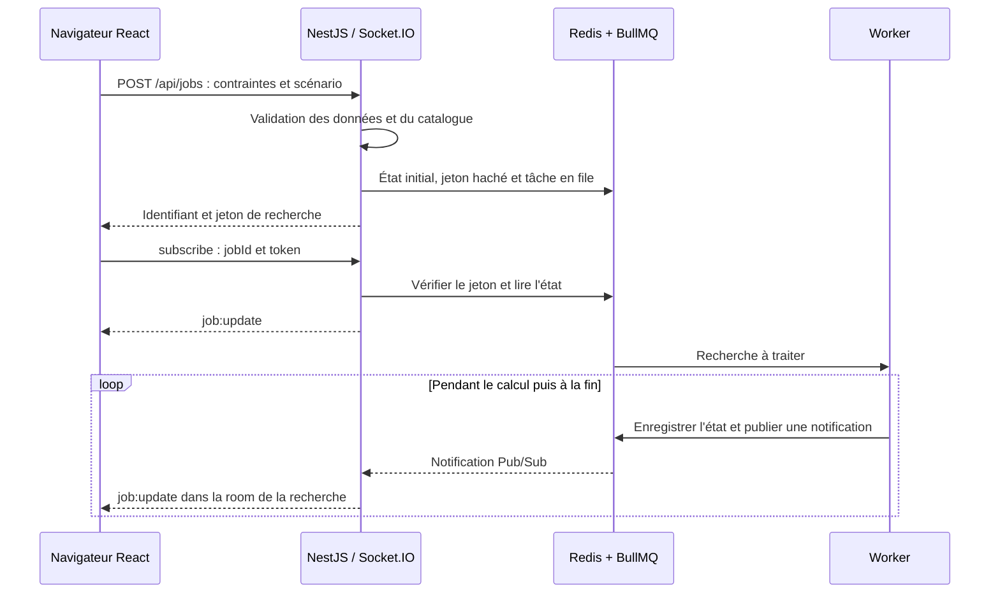

# Architecture

## Services

| Composant | Responsabilité |
|---|---|
| React + Vite | Personnage, critères, priorités, équipements, dégâts, prix et suivi de recherche |
| `@dofus/shared` | Contrats TypeScript, statistiques, validation d'équipement, dégâts et évaluation des critères |
| NestJS | Catalogue HTTP, validation des demandes, création, lecture et annulation des recherches |
| Socket.IO dans NestJS | Abonnements par recherche, émission des états et reconnexion |
| Worker BullMQ | Recherche longue, évaluation des candidats et conservation des résultats |
| Maintenance BullMQ | Vérification hebdomadaire des données, prix et dernière note de mise à jour |
| Redis | File BullMQ, états temporaires, annulation et publication des mises à jour |
| Nginx | Distribution du front compilé et des images locales |
| Traefik | `/api` et `/socket.io` vers NestJS, le reste vers Nginx |

Linux est la plateforme de déploiement principale, avec Docker Engine et le plugin Compose. `sh scripts/start.sh` construit les services, attend leur démarrage et vérifie Redis ainsi qu’un worker. Le lanceur Windows est une commodité optionnelle pour le développement local.

Compose expose uniquement Traefik sur `${APP_BIND_ADDRESS:-127.0.0.1}:${APP_PORT:-8080}`. Pour un accès par l’IP du serveur Linux, définir `APP_BIND_ADDRESS=0.0.0.0` dans `.env`. Le fichier `.env` du poste de développement choisit le port 8180. Les autres services communiquent sur le réseau interne Docker. Traefik utilise une configuration fichier, sans accès au socket Docker. Le routage livré est HTTP ; la terminaison HTTPS pour un domaine doit être configurée lors du déploiement public.

## Flux de recherche

La passerelle conserve une connexion d'abonnement Redis. Le worker enregistre l'état et le publie dans une transaction. Redis Pub/Sub ne rejoue pas seul les messages manqués : la lecture de l'état enregistré lors d'un abonnement ou par HTTP complète le mécanisme. L'inscription à la room précède la lecture de l'état pour éviter une perte de notification pendant une reconnexion.

Le jeton est propre à la recherche et requis pour la lire, s'y abonner ou l'annuler. L'identifiant seul ne donne pas accès aux résultats. Le serveur conserve le hachage du jeton. Les états et accès expirent au bout de 24 heures ; Redis utilise un volume et la persistance AOF. Il ne s'agit pas d'une conservation permanente de comptes utilisateurs.

## Répartition des calculs

Les statistiques, bonus de panoplie, aperçus de sorts et évaluations d'un stuff utilisent les mêmes fonctions pures au front et dans le worker. Le navigateur n'implémente pas une seconde formule divergente.

`EquipmentItem.weapon` porte les paramètres natifs d'attaque, séparés des caractéristiques permanentes. `calculateWeaponDamage` calcule un coup de l'arme, avec ses lignes directes ou de vol de vie, son bonus critique de base et les multiplicateurs propres aux armes. `Constraint.kind: weapon` résout l'arme du candidat dans `Build.slots.weapon`, sans identifiant de sort ni relance. Dégâts et probabilité critique restent deux critères distincts, cumulables. Les préférences d'allocation sont mémorisées par arme et recalculées lors d'un changement d'élément ; l'évaluation exacte garde l'autorité sur le classement et les seuils obligatoires.

L'optimisation s'exécute dans le service `worker`, séparé du processus API/WebSocket. La demande inclut personnage, contraintes, scénario de cible, exclusions, emplacements verrouillés, prix, durée et éventuellement graine de recherche. Les durées admises sont de 3 à 600 secondes. Le plafond par défaut est de 10 millions de candidats évalués, réglable dans `.env` via `MAX_CANDIDATES` de 1 000 à 50 millions ; la durée ou l'annulation peuvent arrêter la recherche plus tôt. Les caches restent bornés à 10 000 évaluations et 1 000 calculs de prérequis, sans croissance proportionnelle au plafond. Plusieurs workers peuvent consommer la même file ; chaque processus traite une recherche à la fois dans cette version.

Le moteur applique les exigences obligatoires aux résultats conservés, puis classe les solutions selon les préférences normalisées. L'ordre et les égalités de priorité suffisent à exprimer l'importance sans exposer de poids chiffrés au joueur. La recherche est heuristique et ne produit pas de certificat d'optimalité.

### Personnage, bonus exos et compatibilité

`Character.baseStats` contient les caractéristiques investies et `scrollStats` le parchotage indépendant. Le module partagé calcule le coût réel par palier et le capital `5 × (niveau − 1)`. En mode `allocationMode: automatic`, par défaut dans l'interface, chaque `Build.baseStats` transporte sa propre allocation. Le worker explore cette dimension avec l'équipement ; `allocateCharacterStats` fournit des allocations de départ légales et l'évaluateur exact détermine leur classement. Le mode `manual` conserve la répartition fixe. Les anciennes requêtes sans mode gardent ce comportement manuel.

`Build.exoBonuses` est une liste de bonus globaux uniques : `actionPoints` et/ou `movementPoints`. Chaque entrée apporte +1 à la caractéristique concernée et doit figurer dans `filters.allowedExos`. Le worker explore les combinaisons autorisées, indépendamment des emplacements. Les verrous portent uniquement sur les objets ; aucun exo n'est affecté à une pièce et l'évaluateur ne valide pas de support de forgemagie. Les signatures de cache et la déduplication des résultats incluent les bonus exos et la répartition de base.

`filters.maxExos` borne le nombre de bonus globaux à 0, 1 ou 2, indépendamment des types autorisés et de leur possession. C'est un plafond, pas une quantité obligatoire. Une requête ancienne sans ce champ conserve la borne de 2 ; le front reprend les profils antérieurs en déduisant une borne équivalente des types déjà autorisés. Les nouvelles recherches de l'interface commencent sans exo (borne 0). L'API contrôle la borne et le stuff initial, le worker filtre les combinaisons et le moteur partagé signale les stuffs qui dépassent le maximum. Une baisse de limite conserve l'aperçu du stuff existant, avec une violation explicite, et le front borne les bonus de l'amorce envoyée à la prochaine recherche.

`PriceBook.exoCosts` contient le supplément estimé par type d'exo, ajouté une seule fois au prix des objets normaux pour chaque bonus présent. `ownedExos` indique les bonus déjà disponibles, qui n'ajoutent aucun achat en mode « achats restants ». Posséder un objet normal ne signifie pas posséder un exo. Un supplément absent reste inconnu et empêche de valider un budget obligatoire lorsqu'il doit être payé. Ce modèle ne prétend pas fournir le prix exact d'une variante d'objet ni le coût d'une tentative de forgemagie.

L'évaluation retourne le détail `breakdown` : base, parchotage, équipement, caractéristiques dérivées et puissance pour les dégâts. Les prérequis utilisent les caractéristiques réelles brutes, avant plafonnement des PA/PM/PO utilisables à 12/6/6 et des cinq résistances élémentaires à 50 %. `STAT_CAPS` sert aussi aux seuils de l'éditeur et de l'API. Les résistances de la cible PvM sont indépendantes. La puissance n'augmente pas les caractéristiques dérivées. Le compteur `activeSetCount` de la 3.7 compte les panoplies comportant au moins deux objets ; l'ancien compteur `setBonus` reste disponible pour les anciens critères explicitement distincts.

`inspectEquipment(catalog, request, evaluation)` fournit à la demande les diagnostics d'équipement pour React : état des conditions par emplacement, groupes incompatibles, limites PA/PM et aperçu des exos. Cette analyse reste en dehors de la boucle d'optimisation. Elle réutilise `evaluateBuild` pour les changements d'exos et les valeurs brutes du détail des caractéristiques pour les prérequis, avant plafonnement. Les prix inconnus ou les objectifs de dégâts manqués ne colorent pas les pièces comme incompatibles. Les branches ET/OU sont conservées et les conditions inconnues restent explicitement non vérifiées.

## Persistance et données

- `data/catalog.json` fournit le catalogue de secours versionné. Le snapshot livré est extrait des fichiers statiques du client 3.7.4.4. Le service de maintenance vérifie les exports DofusDude chaque lundi à 03:00 Europe/Paris et au démarrage, ou un flux normalisé configuré. Le déploiement Linux ne dépend pas d'une installation du jeu.
- Le volume `game-data` conserve catalogue actif, relevés automatiques et rapports de maintenance. Les remplacements sont atomiques et les versions plus anciennes refusées. L'API et les workers rechargent entre les demandes ; chaque recherche utilise une révision immuable identifiée par son empreinte.
- Les images de `apps/web/public/game/` sont intégrées à l'image web.
- Réglages, stuffs, carnets de prix et références de recherche sont enregistrés dans le navigateur. L'export JSON permet de garder une copie.
- Les anciens profils passent en répartition automatique par défaut ; le parchotage reste à vérifier séparément. Un changement de version du catalogue invalide la référence à une ancienne recherche ; les équipements manuels sont réévalués avec les nouvelles données.
- Le contexte d'optimisation est envoyé au serveur au lancement ; progression et résultats temporaires sont conservés dans Redis.
- `PRICE_FEED_URL` alimente les prix automatiques par serveur ; aucun fournisseur n'est configuré par défaut. `PriceBook.automaticValues` et `automaticExoCosts` restent distincts des corrections manuelles `values` et `exoCosts`, prioritaires. Le relevé conserve sa date de source ; `updatedAt` du carnet manuel reste la date de modification par l'utilisateur.
- Les patch notes sont conservées comme titres, liens et extraits. Leurs phrases n'écrasent pas les formules : les changements chiffrés passent par le catalogue structuré validé. Voir [la maintenance](MAINTENANCE.md).

## Routes et événements

| Interface | Usage |
|---|---|
| `GET /api/health` | Redis, nombre de workers et version du catalogue |
| `GET /api/catalog` | Catalogue local versionné |
| `GET /api/maintenance` | Dernière vérification des sources et planification |
| `GET /api/prices?server=…` | Dernier relevé automatique du serveur |
| `POST /api/jobs` | Créer une recherche |
| `GET /api/jobs/:id?token=…` | Lire un état autorisé |
| `POST /api/jobs/:id/cancel` | Demander l'arrêt avec le jeton |
| Socket.IO `/socket.io`, événement `subscribe` | Rejoindre une recherche avec `{ jobId, token }` |
| Événement `job:update` | État, progression, résultats et éventuelle erreur |
| Événement `unsubscribe` | Quitter l'abonnement |

Socket.IO ajoute son protocole et la reconnexion au transport WebSocket ; un client WebSocket brut doit parler ce protocole. Le transport de repli HTTP est aussi activé.

## Validation

`npm run build` compile tous les composants. `npm test` exécute les tests du moteur, de validation, de sécurité et d'optimisation. Définir `API_URL` sur l'URL Traefik active le test réseau contre les services démarrés. Les contrôles de santé Compose et du lanceur vérifient la disponibilité, pas le parcours utilisateur complet.

Les limites de simulation figurent dans [le plan](PLAN.md) et les [références de calcul](../data/CALCULATION_NOTES.md). Les prochaines extensions concernent les références vérifiées en jeu, effets spéciaux et rotations, puis les jets personnalisés, overmages et scénarios PvP.
