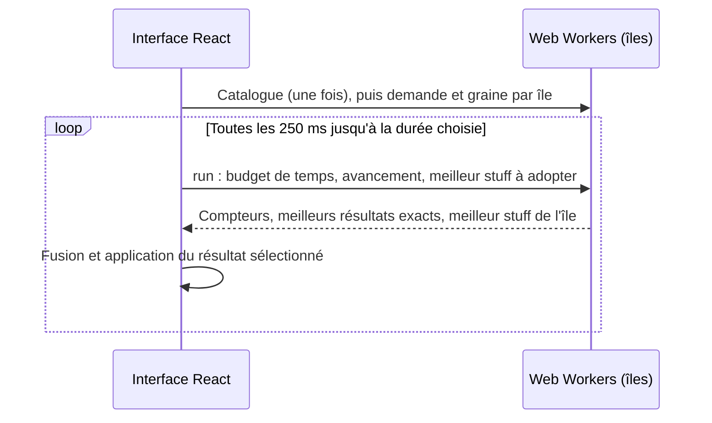

# Architecture

## Services

| Composant | Responsabilité |
|---|---|
| React + Vite | Personnage, critères, priorités, équipements, dégâts, prix, et recherche dans des Web Workers |
| `@dofus/shared` | Contrats TypeScript, statistiques, validation d'équipement, dégâts, évaluation des critères et moteur de recherche (`@dofus/shared/search`) |
| NestJS | Catalogue, limites de débit et administration |
| Nginx | Distribution du front compilé et des images locales |
| Traefik | `/api` vers NestJS, le reste vers Nginx |

Linux est la plateforme de déploiement principale, avec Docker Engine et le plugin Compose. Après configuration de `.env`, `docker compose up --build -d` construit et démarre les deux services applicatifs.

Le Compose principal réutilise le Traefik existant du VPS : routes HTTPS sur les domaines de `.env` et redirection HTTP, sans nouveau proxy ni port publié. Nginx et l'API rejoignent son réseau partagé. Les images, ports, origines, ressources et paramètres du proxy sont également dans `.env`. Les conteneurs ont des capacités supprimées et un système de fichiers en lecture seule. Le mode de développement facultatif sélectionne explicitement `compose.local.yaml` pour ajouter un proxy local ; il utilise actuellement le port 8180.

## Flux de recherche

Toute la recherche tourne dans le navigateur : aucune demande n'est envoyée au serveur et le catalogue déjà chargé par l'interface suffit. `useOptimization` démarre jusqu'à quatre îles (cœurs disponibles moins un) qui gardent chacune leur copie du catalogue entre deux recherches. Toutes les quatre manches, chaque île peut repartir du meilleur stuff des autres (migration). L'arrêt prend effet à la fin de la manche en cours.

## Répartition des calculs

Les statistiques, bonus de panoplie, aperçus de sorts et évaluations d'un stuff utilisent les mêmes fonctions pures pour l'affichage et pour la recherche.

`EquipmentItem.weapon` porte les paramètres natifs d'attaque, séparés des caractéristiques permanentes. `calculateWeaponDamage` calcule un coup de l'arme, avec ses lignes directes ou de vol de vie, son bonus critique de base et les multiplicateurs propres aux armes. `Constraint.kind: weapon` résout l'arme du candidat dans `Build.slots.weapon`, sans identifiant de sort ni relance. Dégâts et probabilité critique restent deux critères distincts, cumulables. Les préférences d'allocation sont mémorisées par arme et recalculées lors d'un changement d'élément ; l'évaluation exacte garde l'autorité sur le classement et les seuils obligatoires.

`createSearch` (`@dofus/shared/search`) compile la demande en vecteurs de statistiques (objets, paliers de panoplie, base, coûts, conditions) puis mène un recuit simulé : remplacement d'une ou deux pièces, passage à une panoplie complète, transfert de points de base, redémarrages depuis les meilleurs stuffs. Toutes les combinaisons d'exos permises sont évaluées pour chaque candidat. Ce modèle rapide reproduit exactement le score et la validité de `evaluateBuild` (test `tests/search-model.test.mjs`) ; chaque stuff retenu repasse de plus par `evaluateBuild`. La demande inclut personnage, contraintes, scénario de cible, exclusions, emplacements verrouillés, prix, durée (3 à 600 secondes) et éventuellement graine de recherche.

Le moteur applique les exigences obligatoires aux résultats conservés, puis classe les solutions selon les préférences normalisées. L'ordre et les égalités de priorité suffisent à exprimer l'importance sans exposer de poids chiffrés au joueur. La recherche est heuristique et ne produit pas de certificat d'optimalité.

Un critère de sort avec `metric: "criticalChance"` mesure son pourcentage final de critique, entre 0 et 100, à partir du rang disponible et du bonus `criticalHit` du stuff. Il ne reçoit ni `mode` ni `turnOffset`. Un critère de dégâts séparé peut viser le même `spellId`, avec sa propre priorité ; la recherche privilégie alors les bonus de critique pour le premier et les caractéristiques de dégâts pour le second.

Seuls les candidats valides sont proposés ; des prix inconnus ne sont jamais assimilés à des prix nuls et les emplacements Dofus peuvent rester libres. Les alternatives dont seuls les emplacements des anneaux ou Dofus sont permutés sont regroupées. Deux exemplaires d'un anneau hors panoplie sont autorisés ; les doublons de Dofus ou trophées et d'anneaux de panoplie sont interdits, et une seule prysmaradite peut être équipée. Ces règles sont corroborées par les [vérifications publiques de DofusLab](https://github.com/dofuslab/dofuslab/blob/master/client/common/utils.tsx#L1389). Les résultats sont les meilleurs trouvés, sans preuve d'optimalité ; l'absence de résultat ne prouve pas l'impossibilité des contraintes.

### Personnage, bonus exos et compatibilité

`Character.baseStats` contient les caractéristiques investies et `scrollStats` le parchotage indépendant. Le module partagé calcule le coût réel par palier et le capital `5 × (niveau − 1)`. En mode `allocationMode: automatic`, par défaut dans l'interface, chaque `Build.baseStats` transporte sa propre allocation. Le moteur explore cette dimension avec l'équipement ; `allocateCharacterStats` fournit des allocations de départ légales et l'évaluateur exact détermine leur classement. Le mode `manual` conserve la répartition fixe. Les anciennes requêtes sans mode gardent ce comportement manuel.

`Build.exoBonuses` est une liste de bonus globaux uniques : `actionPoints` et/ou `movementPoints`. Chaque entrée apporte +1 à la caractéristique concernée et doit figurer dans `filters.allowedExos`. Le moteur évalue les combinaisons autorisées, indépendamment des emplacements. Les verrous portent uniquement sur les objets ; aucun exo n'est affecté à une pièce et l'évaluateur ne valide pas de support de forgemagie. La déduplication des résultats inclut les bonus exos.

`filters.maxExos` borne le nombre de bonus globaux à 0, 1 ou 2, indépendamment des types autorisés et de leur possession. C'est un plafond, pas une quantité obligatoire. Une requête ancienne sans ce champ conserve la borne de 2 ; le front reprend les profils antérieurs en déduisant une borne équivalente des types déjà autorisés. Les nouvelles recherches de l'interface commencent sans exo (borne 0). Le moteur filtre les combinaisons et l'évaluateur partagé signale les stuffs qui dépassent le maximum. Une baisse de limite conserve l'aperçu du stuff existant, avec une violation explicite, et le front borne les bonus de l'amorce envoyée à la prochaine recherche.

`PriceBook.exoCosts` contient le supplément estimé par type d'exo, ajouté une seule fois au prix des objets normaux pour chaque bonus présent. `ownedExos` indique les bonus déjà disponibles, qui n'ajoutent aucun achat en mode « achats restants ». Posséder un objet normal ne signifie pas posséder un exo. Un supplément absent reste inconnu et empêche de valider un budget obligatoire lorsqu'il doit être payé. Ce modèle ne prétend pas fournir le prix exact d'une variante d'objet ni le coût d'une tentative de forgemagie.

L'évaluation retourne le détail `breakdown` : base, parchotage, équipement, caractéristiques dérivées et puissance pour les dégâts. Les prérequis utilisent les caractéristiques réelles brutes, avant plafonnement des PA/PM/PO utilisables à 12/6/6 et des cinq résistances élémentaires à 50 %. `STAT_CAPS` sert aussi aux seuils de l'éditeur. Les résistances de la cible PvM sont indépendantes. La puissance n'augmente pas les caractéristiques dérivées. Le compteur `activeSetCount` de la 3.7 compte les panoplies comportant au moins deux objets ; l'ancien compteur `setBonus` reste disponible pour les anciens critères explicitement distincts.

`inspectEquipment(catalog, request, evaluation)` fournit à la demande les diagnostics d'équipement pour React : état des conditions par emplacement, groupes incompatibles, limites PA/PM et aperçu des exos. Cette analyse reste en dehors de la boucle d'optimisation. Elle réutilise `evaluateBuild` pour les changements d'exos et les valeurs brutes du détail des caractéristiques pour les prérequis, avant plafonnement. Les prix inconnus ou les objectifs de dégâts manqués ne colorent pas les pièces comme incompatibles. Les branches ET/OU sont conservées et les conditions inconnues restent explicitement non vérifiées.

## Persistance et données

- `data/catalog.json` fournit le catalogue de secours versionné. Le snapshot livré est extrait des fichiers statiques du client 3.7.4.4. Le déploiement Linux ne dépend pas d'une installation du jeu.
- L'API lit le catalogue au démarrage ; sa révision est identifiée par son empreinte.
- Les images de `apps/web/public/game/` sont intégrées à l'image web.
- Réglages, stuffs et carnets de prix sont enregistrés dans le navigateur. L'export JSON permet de garder une copie.
- Les anciens profils passent en répartition automatique par défaut ; le parchotage reste à vérifier séparément. Après un changement de version du catalogue, les équipements sont réévalués avec les nouvelles données.
- Les prix viennent des saisies et imports de l'utilisateur (`PriceBook.values` et `exoCosts`) ; aucun fournisseur automatique n'est branché.

## Routes

| Interface | Usage |
|---|---|
| `GET /api/health` | Version du catalogue |
| `GET /api/catalog` | Catalogue local versionné |
| `GET /api/admin/overview` | Administration, avec `Authorization: Bearer <ADMIN_TOKEN>` |

## Validation

`npm run build` compile tous les composants. `npm test` exécute les tests du moteur, de sécurité et de recherche. Définir `API_URL` sur l'URL Traefik active les tests réseau contre les services démarrés. Les contrôles de santé Compose vérifient la disponibilité, pas le parcours utilisateur complet. Les limites de débit et en-têtes du navigateur sont décrits dans le [rapport de sécurité](SECURITY_AUDIT.md).

Les limites de simulation figurent dans [le plan](PLAN.md) et les [références de calcul](../data/CALCULATION_NOTES.md). Les prochaines extensions concernent les références vérifiées en jeu, effets spéciaux et rotations, puis les jets personnalisés, overmages et scénarios PvP.
